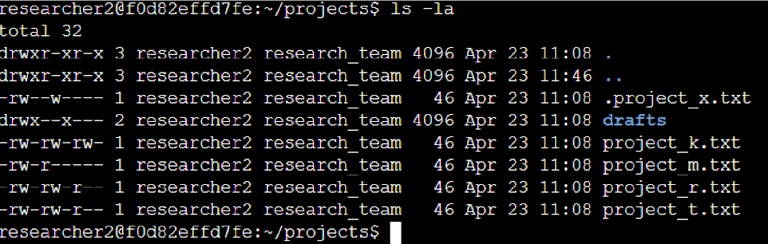
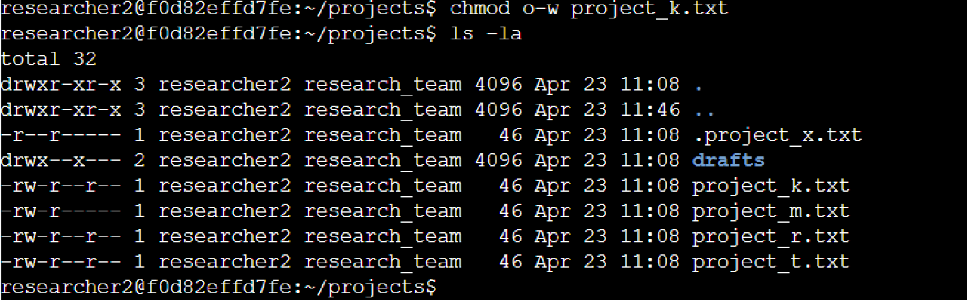
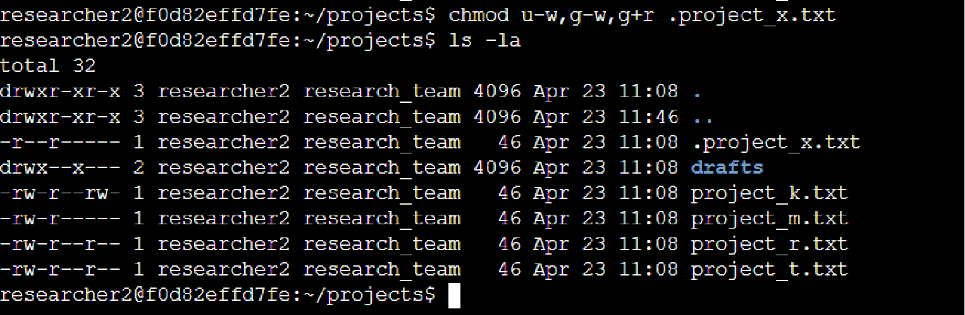
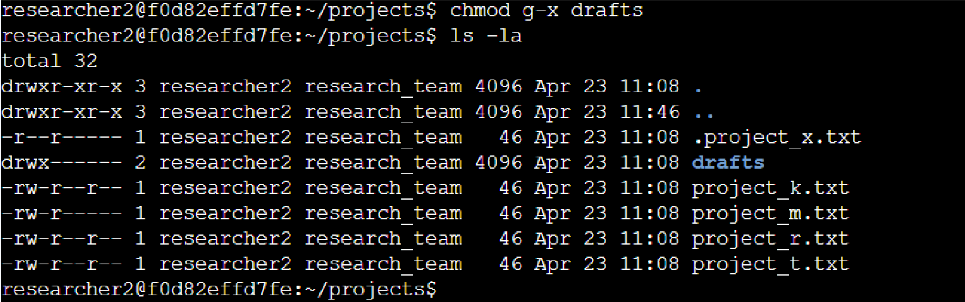

# Linux File Permission Management

## Project Description

As part of a security review for my organization's research team, I audited the existing file and directory permissions in a Linux environment using Bash. The goal was to verify that every user had the appropriate level of access, remove permissions that no longer complied with the organization's security policy, and ensure sensitive files remained protected. Throughout this project, I reviewed the current permissions, updated authorization where necessary, and verified each change before moving to the next task.

---

# Check File and Directory Details

Before making any changes, I needed to understand the current permission settings for every file and directory inside the `projects` directory.

```bash
ls -la
```

<div align="center">



<p><em>Figure 1 — Listing all files, directories, and hidden files inside the <code>projects</code> directory.</em></p>

</div>

My first step was to inspect the directory using `ls -la`. This command displays every file and directory, including hidden files whose names begin with a period (`.`). Reviewing this output gave me an immediate overview of the current permission settings and helped identify which files required changes before applying any modifications.

---

# Describe the Permission String

Linux represents permissions using a **10-character permission string** that indicates both the file type and the permissions assigned to different users.

For example:

```text
-rwx---r--
```

This permission string can be interpreted as follows:

- The **first character (`-`)** identifies the object as a regular file. If this character were `d`, it would represent a directory.
- The **next three characters (`rwx`)** represent the permissions assigned to the file owner. In this example, the owner has read, write, and execute access.
- The **following three characters (`---`)** represent the permissions assigned to the group. Since all three positions contain hyphens, the group has no permissions.
- The **last three characters (`r--`)** represent the permissions granted to others. Here, other users can read the file but cannot write to or execute it.

Understanding how this permission string is organized made it much easier to identify which permissions needed to be updated during the audit.

---

# Change File Permissions

While reviewing the directory, I noticed that `project_k.txt` still allowed write access that was no longer permitted by the organization's security policy. According to the updated requirements, users outside the owner and group should only have read access.

To correct this, I removed write permission for others.

```bash
chmod o-w project_k.txt
ls -la
```

<div align="center">



<p><em>Figure 2 — Verifying that write permission for others has been removed from <code>project_k.txt</code>.</em></p>

</div>

I used symbolic notation (`o-w`) because I only needed to remove one specific permission instead of recalculating the complete permission set using octal notation.

After running `ls -la` again, I confirmed that the write permission for others had been removed while every other permission remained unchanged.

---

# Change File Permissions on a Hidden File

The next file I reviewed was `.project_x.txt`, an archived file used by the research team.

Because the filename begins with a period (`.`), it is hidden from a standard directory listing. Fortunately, using `ls -la` earlier ensured the file appeared alongside the other project files.

The organization's updated policy required that:

- The owner should no longer have write permission.
- The group should no longer have write permission.
- The group should continue to have read access.

To apply those changes, I used the following command.

```bash
chmod u-w,g-w,g+r .project_x.txt
ls -la .project_x.txt
```

<div align="center">



<p><em>Figure 3 — Updated permissions for the archived hidden file <code>.project_x.txt</code>.</em></p>

</div>

I chose symbolic notation (`u-w,g-w,g+r`) because it allowed me to modify only the required permission bits instead of replacing the file's entire permission mode.

After verifying the updated permission string, I confirmed that the hidden file now matched the organization's authorization requirements.

---

# Change Directory Permissions

The final task involved updating the permissions for the `drafts` directory.

Only the `researcher2` user should have access to this directory and everything stored inside it. Since the owner already had the required permissions, I only needed to remove execute permission from the group.

```bash
chmod g-x drafts
ls -ld drafts
```

<div align="center">



<p><em>Figure 4 — Final permissions for the <code>drafts</code> directory after removing group execute access.</em></p>

</div>

Rather than changing the entire permission set, I modified only the permission that no longer matched the security policy. Running `ls -ld drafts` confirmed that the group execute bit had been removed while `researcher2` retained the required access.

---

# Summary

This project provided practical experience managing Linux file permissions using Bash. I began by reviewing the existing authorization settings with `ls -la`, interpreted the Linux permission strings, updated file and directory permissions using `chmod`, and verified every change after it was applied.

By making targeted permission changes instead of broad modifications, I ensured that sensitive files and directories followed the organization's security policy while maintaining access for authorized users. This exercise reinforced the importance of applying the principle of least privilege to protect systems without disrupting legitimate work.
