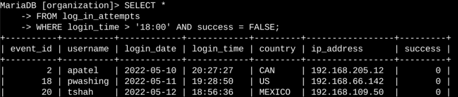
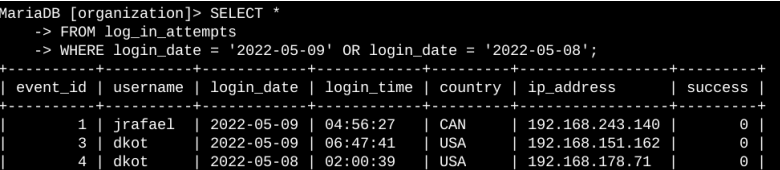
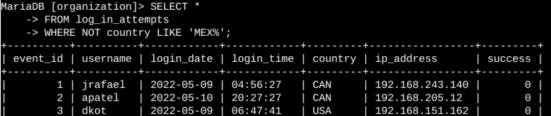
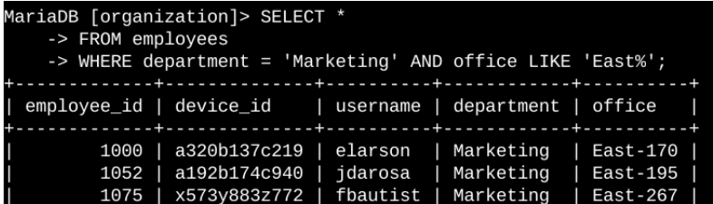
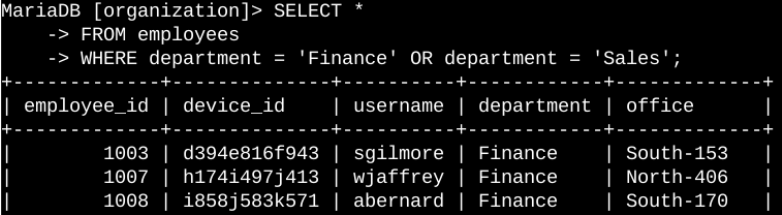
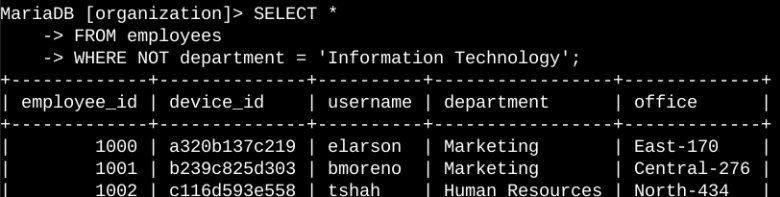

# Apply Filters to SQL Queries

## Project Overview

This project demonstrates how SQL filtering techniques can be used to investigate security events and retrieve specific information from organizational databases. Working with the `log_in_attempts` and `employees` tables, I used SQL queries to identify suspicious login activity and retrieve employee records required for security-related tasks. Throughout the investigation, I applied filtering techniques such as `WHERE`, `AND`, `OR`, `NOT`, and `LIKE` to isolate only the records relevant to each scenario.

---

## Scenario

As a security analyst, I was responsible for investigating potential security issues involving login attempts and employee machines. The organization suspected unusual authentication activity and needed to identify specific users and systems that required further investigation or security updates.

Using SQL queries, I analyzed authentication logs and employee records to retrieve only the information needed for each security task.

---

## Role

My responsibilities during this investigation included:

- Investigating suspicious login activity.
- Retrieving employee records for security updates.
- Applying SQL filters to narrow large datasets.
- Supporting security investigations with accurate database queries.

---

## Available Resources

The investigation used the following database tables:

| Table | Purpose |
|--------|---------|
| `log_in_attempts` | Stores user authentication records, including login dates, times, locations, and login status. |
| `employees` | Stores employee information such as department, office location, and assigned workstation details. |

---

## Objective

The objective of this project was to retrieve only the information required for each security investigation without reviewing unnecessary records. By combining SQL filtering operators such as `WHERE`, `AND`, `OR`, `NOT`, and `LIKE`, I was able to efficiently narrow large datasets into smaller result sets that supported each security task.

---

# Retrieve After-Hours Failed Login Attempts

### Description

A potential security incident occurred after normal business hours. My first task was to identify every failed login attempt that occurred after **18:00** so that the security team could investigate suspicious authentication activity.

### SQL Query

```sql
SELECT *
FROM log_in_attempts
WHERE login_time > '18:00'
  AND success = FALSE;
```

<div align="center">



<p><em>Figure 1 — SQL query and output showing failed login attempts after business hours.</em></p>

</div>

### Query Breakdown

- `SELECT *` retrieves every column from the `log_in_attempts` table.
- `WHERE` begins the filtering process.
- `login_time > '18:00'` limits the results to login attempts that occurred after business hours.
- `success = FALSE` returns only unsuccessful login attempts.
- The `AND` operator ensures that both conditions must be satisfied before a record is returned.

### Security Insight

This query isolated failed authentication attempts that occurred outside normal business hours. Narrowing the dataset in this way allowed the investigation to focus on potentially suspicious login activity instead of reviewing every authentication record in the database.

---
# Retrieve Login Attempts on Specific Dates

### Description

A suspicious security event was reported on **2022-05-09**. To determine whether there was any related activity, I reviewed all login attempts that occurred on the reported date as well as the previous day.

### SQL Query

```sql
SELECT *
FROM log_in_attempts
WHERE login_date = '2022-05-09'
   OR login_date = '2022-05-08';
```

<div align="center">



<p><em>Figure 2 — SQL query and output showing login attempts on the specified investigation dates.</em></p>

</div>

### Query Breakdown

- `SELECT *` retrieves every column from the `log_in_attempts` table.
- `WHERE` begins filtering the dataset.
- `login_date = '2022-05-09'` returns login attempts that occurred on the reported date.
- `login_date = '2022-05-08'` returns login attempts from the previous day.
- The `OR` operator returns records that match either date.

### Security Insight

Reviewing login activity across both dates provided a broader view of authentication events surrounding the reported incident. Including the previous day's activity helped identify whether suspicious behavior had started before the incident was detected.

---

# Retrieve Login Attempts Outside of Mexico

### Description

After reviewing the authentication logs, the investigation determined that the suspicious activity did not originate in Mexico. My next task was to identify login attempts that occurred outside the country for further analysis.

### SQL Query

```sql
SELECT *
FROM log_in_attempts
WHERE NOT country LIKE 'MEX%';
```

<div align="center">



<p><em>Figure 3 — SQL query and output showing login attempts originating outside of Mexico.</em></p>

</div>

### Query Breakdown

- `SELECT *` retrieves every column from the `log_in_attempts` table.
- `WHERE` filters the authentication records.
- `LIKE 'MEX%'` searches for every country value that begins with **MEX**.
- The `%` wildcard matches any remaining characters, allowing both **MEX** and **MEXICO** to be included.
- `NOT` reverses the condition and returns only login attempts that originated outside Mexico.

### Security Insight

Using `LIKE` together with the `%` wildcard ensured that both country formats stored in the database were considered. Applying the `NOT` operator excluded those records, allowing the investigation to focus only on authentication attempts originating outside Mexico.

---
# Retrieve Employees in Marketing

### Description

The security team planned to deploy updates to employee computers in the **Marketing** department located in the **East** building. Before the updates could begin, I needed to identify only the employee machines that matched both requirements.

### SQL Query

```sql
SELECT *
FROM employees
WHERE department = 'Marketing'
  AND office LIKE 'East%';
```

<div align="center">



<p><em>Figure 4 — SQL query and output identifying Marketing employees working in the East building.</em></p>

</div>

### Query Breakdown

- `SELECT *` retrieves every column from the `employees` table.
- `WHERE` begins filtering the employee records.
- `department = 'Marketing'` limits the results to employees in the Marketing department.
- `office LIKE 'East%'` searches for office locations that begin with **East**.
- The `%` wildcard matches any office number that follows the building name.
- The `AND` operator ensures that both conditions must be true before a record is returned.

### Security Insight

Combining the department and office location filters reduced the dataset to only the employee machines that required the planned security update. Using `LIKE` allowed every office in the East building to be included without specifying individual office numbers.

---

# Retrieve Employees in Finance or Sales

### Description

A different security update was required for employees working in the **Finance** and **Sales** departments. Since the update applied to either department, I retrieved employee records belonging to both groups.

### SQL Query

```sql
SELECT *
FROM employees
WHERE department = 'Finance'
   OR department = 'Sales';
```

<div align="center">



<p><em>Figure 5 — SQL query and output identifying employees from the Finance and Sales departments.</em></p>

</div>

### Query Breakdown

- `SELECT *` retrieves every column from the `employees` table.
- `WHERE` begins filtering the dataset.
- `department = 'Finance'` selects employees in the Finance department.
- `department = 'Sales'` selects employees in the Sales department.
- The `OR` operator returns records that satisfy either condition.

### Security Insight

Using the `OR` operator allowed both departments to be retrieved in a single query. This approach simplified the process of identifying employee machines that required the same security update while avoiding multiple database queries.

---
# Retrieve Employees Not in Information Technology

### Description

The final security update applied to every employee except those in the **Information Technology** department, as their systems had already been updated. To identify the remaining employee machines, I filtered the employee records to exclude the Information Technology department.

### SQL Query

```sql
SELECT *
FROM employees
WHERE NOT department = 'Information Technology';
```

<div align="center">



<p><em>Figure 6 — SQL query and output identifying employees outside the Information Technology department.</em></p>

</div>

### Query Breakdown

- `SELECT *` retrieves every column from the `employees` table.
- `WHERE` begins filtering the employee records.
- `department = 'Information Technology'` identifies employees in the Information Technology department.
- The `NOT` operator reverses the condition and excludes those employees from the results.

### Security Insight

Using the `NOT` operator made it easy to exclude employees who had already received the required security update. Instead of listing every remaining department individually, the query automatically returned all employees outside the Information Technology department, making the query simpler and easier to maintain.

---

# Summary

This project demonstrates how SQL filtering techniques can be applied to investigate security events and retrieve targeted information from organizational databases. Throughout the investigation, I queried the `log_in_attempts` and `employees` tables to identify suspicious authentication activity and determine which employee systems required security updates.

Each task focused on a different investigation scenario, requiring the use of SQL filtering operators such as `WHERE`, `AND`, `OR`, `NOT`, and `LIKE` to narrow large datasets into meaningful results. These filtering techniques made it possible to efficiently retrieve only the records relevant to each security task.

Completing this project strengthened my understanding of SQL as a practical tool for cybersecurity investigations. By applying different filtering techniques, I was able to analyze authentication logs, investigate suspicious login activity, and retrieve employee information needed to support organizational security operations.