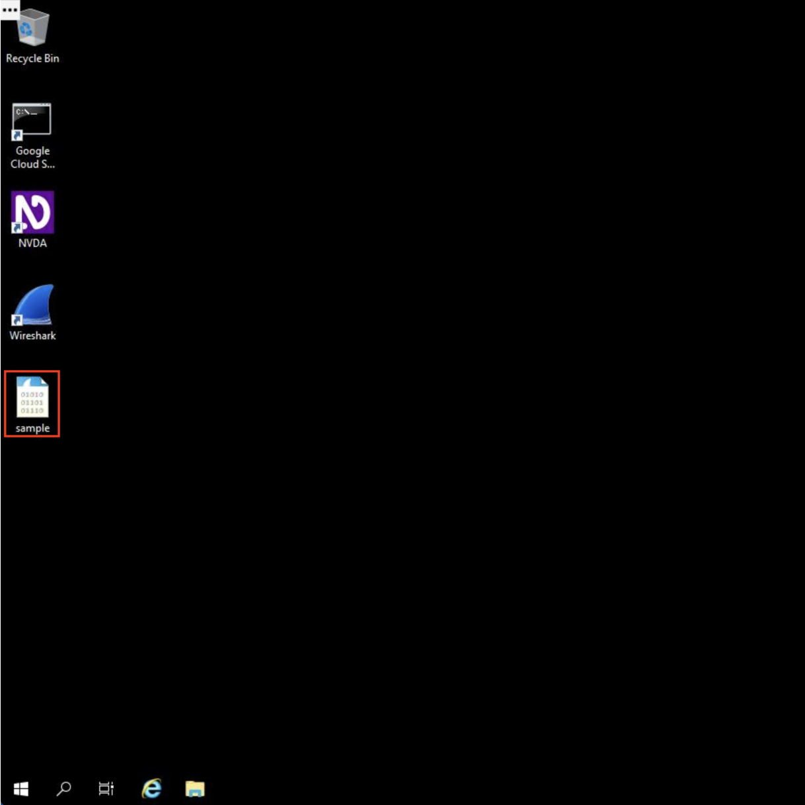
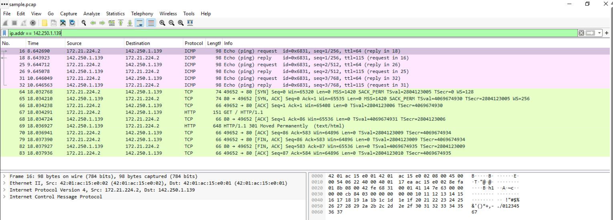
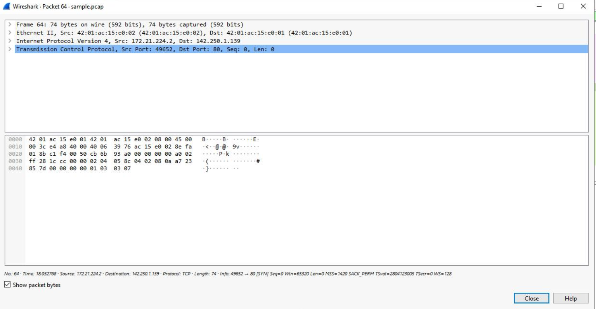
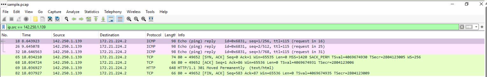
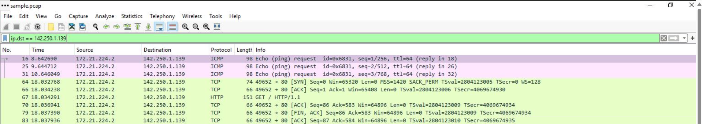
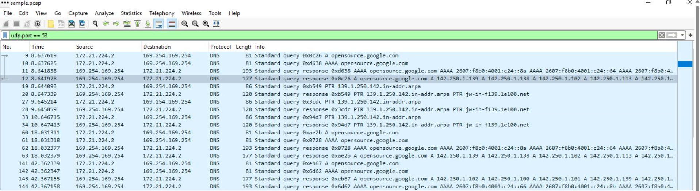
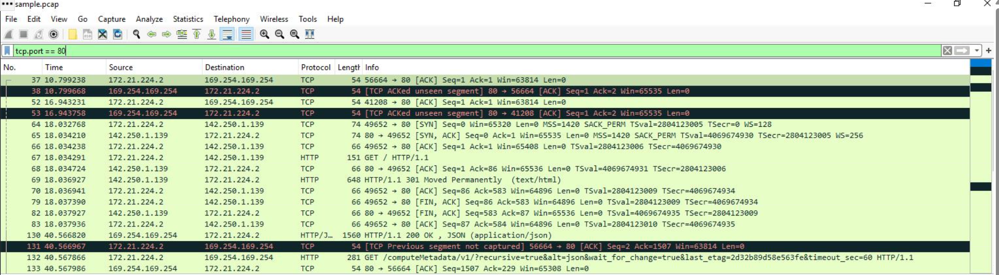

# Wireshark Packet Analysis

## Overview

This project demonstrates how I used Wireshark to inspect captured network traffic and analyze packets during a network investigation. The activity focused on navigating the Wireshark interface, applying display filters, examining packet details, and understanding how different network protocols communicate.

Throughout the investigation, I analyzed network traffic by filtering packets based on IP addresses, source and destination hosts, DNS activity, and HTTP traffic. These techniques help reduce large packet captures into smaller, relevant datasets, allowing security analysts to investigate network activity more efficiently.

---

## Scenario

As a security analyst, I was provided with a packet capture (`.pcap`) file containing network traffic generated during normal communication between multiple systems. Since packet capture files often contain hundreds of packets, manually inspecting every packet would be inefficient.

To investigate the traffic, I used Wireshark's display filters to isolate specific packets, inspect protocol information, and better understand the communication occurring between devices on the network.

---

## Objective

The objectives of this activity were to:

- Open and navigate a packet capture using Wireshark.
- Understand the layout of the Wireshark interface.
- Apply display filters to narrow packet results.
- Inspect packet details across multiple protocol layers.
- Analyze network communication using common protocols such as IP, DNS, TCP, and HTTP.

---

# Explore the Packet Capture

## Description

The investigation began by opening the provided packet capture file in Wireshark. Before applying any display filters, I reviewed the captured traffic to understand the overall communication occurring between systems.

<div align="center">

</div>

The packet list displays every captured frame along with useful information such as the packet number, timestamp, source address, destination address, protocol, packet length, and a brief summary of the communication.

Reviewing the capture before filtering provided an overview of the network activity and helped identify the different protocols present in the dataset. This initial review also made it easier to determine which display filters would be useful during the investigation.

---
# Filter Traffic by IP Address

## Description

After reviewing the packet capture, I narrowed the investigation by filtering traffic associated with a specific IP address. Display filters are useful when packet captures contain large amounts of traffic because they allow only the relevant packets to remain visible.

For this investigation, I filtered the capture to display all packets involving the IP address **142.250.1.139**.

### Display Filter

```text
ip.addr == 142.250.1.139
```

<div align="center">

</div>

## Analysis

The `ip.addr` display filter returns every packet where the specified IP address appears as either the source or the destination. This provides a complete view of the communication involving a particular host without requiring separate source and destination filters.

After applying the filter, I observed multiple protocols associated with the host, including ICMP, TCP, and HTTP traffic. Reducing the capture to packets related to a single system made it much easier to follow the communication flow and focus the investigation.

---

# Inspect Packet Details

## Description

Once the relevant packets were isolated, I inspected an individual packet to examine the protocol information contained within it. Wireshark organizes packet information into multiple protocol layers, allowing each layer of the communication to be analyzed independently.

<div align="center">

</div>

## Analysis

The selected packet displays several protocol layers that describe how the communication was transmitted across the network.

The packet details pane includes:

- **Frame** – Information about the captured packet, including its size and capture details.
- **Ethernet II** – Displays the source and destination MAC addresses used for communication on the local network.
- **Internet Protocol Version 4 (IPv4)** – Contains the source and destination IP addresses responsible for routing the packet across the network.
- **Transmission Control Protocol (TCP)** – Provides transport-layer information such as source and destination ports, sequence numbers, and connection details.

Inspecting these protocol layers provides a deeper understanding of how data travels across the network. Instead of relying only on the packet summary, the packet details pane exposes the information required to analyze communication at each layer of the TCP/IP model.

---
# Analyze Source and Destination IP Addresses

## Description

To better understand the communication between systems, I analyzed the packets based on their source and destination IP addresses. Instead of viewing all traffic associated with the host, these filters isolate packets depending on whether the host is sending or receiving data.

Examining each direction separately provides a clearer picture of the communication flow and helps determine how systems exchange information during a network session.

---

### Source IP Address Filter

The first filter displays packets where **142.250.1.139** is the source of the communication.

#### Display Filter

```text
ip.src == 142.250.1.139
```

<div align="center">

</div>

#### Analysis

The `ip.src` display filter returns only the packets transmitted by the specified IP address. This allows outgoing traffic from the host to be analyzed independently from incoming traffic.

By examining these packets, I observed the responses generated by the remote host, including ICMP replies, TCP acknowledgments, and HTTP responses. Separating outbound traffic helps identify the actions performed by a specific device during network communication.

---

### Destination IP Address Filter

Next, I filtered the packet capture to display packets where **142.250.1.139** is the destination address.

#### Display Filter

```text
ip.dst == 142.250.1.139
```

<div align="center">

</div>

#### Analysis

The `ip.dst` display filter returns only the packets sent toward the specified host. Viewing incoming traffic separately makes it easier to identify connection requests, data transfers, and responses directed to the system.

Comparing the source and destination filters provides a complete understanding of the communication between the two hosts and illustrates how requests and responses travel across the network.

---

# Analyze DNS Traffic

## Description

Domain Name System (DNS) traffic plays an important role in network communication by translating domain names into IP addresses. Before establishing many network connections, a client typically performs a DNS query to determine the destination server's IP address.

To examine this process, I filtered the capture to display only DNS-related traffic.

### Display Filter

```text
udp.port == 53
```

<div align="center">

</div>

## Analysis

Filtering on UDP port **53** displays DNS requests and responses exchanged between the client and the DNS server.

From the filtered traffic, I observed standard DNS queries requesting IP address information for domain names, followed by the corresponding DNS responses containing the resolved addresses. These packets demonstrate how DNS resolution occurs before network communication with external services.

Isolating DNS traffic is a common technique during network investigations because it helps identify the domains accessed by a system and can reveal suspicious or unexpected name resolution activity.

---
# Analyze HTTP Traffic

## Description

Hypertext Transfer Protocol (HTTP) is commonly used to transfer web content between a client and a web server. Since HTTP operates over TCP port **80**, I filtered the packet capture to display only HTTP-related traffic and inspect the communication occurring between the client and the web server.

Focusing on a single protocol makes it easier to understand how web requests and responses are exchanged during a browsing session.

### Display Filter

```text
tcp.port == 80
```

<div align="center">

</div>

## Analysis

The `tcp.port == 80` display filter returns packets associated with HTTP communication over TCP port 80. This allows HTTP requests and responses to be viewed without unrelated network traffic appearing in the packet list.

After applying the filter, I observed TCP segments associated with web communication, making it easier to follow the exchange of data between the client and the web server. Filtering by port is a practical technique for isolating specific application traffic during network investigations.

Examining HTTP traffic also demonstrates how application-layer protocols rely on TCP to provide reliable communication between systems.

---

# Key Concepts Learned

Throughout this activity, I developed practical experience using Wireshark to inspect and analyze captured network traffic. The investigation strengthened my understanding of packet analysis and demonstrated how display filters can significantly reduce the amount of traffic that needs to be reviewed during a security investigation.

The activity covered several important concepts, including:

- Opening and navigating packet capture (`.pcap`) files.
- Understanding the Wireshark interface and packet list.
- Applying display filters to isolate relevant network traffic.
- Inspecting packet information across multiple protocol layers.
- Identifying source and destination IP addresses.
- Analyzing DNS traffic using UDP port 53.
- Examining HTTP communication over TCP port 80.
- Understanding how multiple network protocols interact during communication.

---

# Summary

This project demonstrates how Wireshark can be used to investigate captured network traffic by applying display filters and inspecting individual packets. Throughout the investigation, I explored the Wireshark interface, examined protocol details, and analyzed communication between systems using IP, DNS, TCP, and HTTP traffic.

By narrowing packet captures with display filters and reviewing protocol-specific information, I gained a better understanding of how network communication occurs across different layers of the TCP/IP model. These packet analysis techniques are fundamental skills for Security Operations Center (SOC) analysts when investigating network activity, troubleshooting connectivity issues, and responding to security incidents.