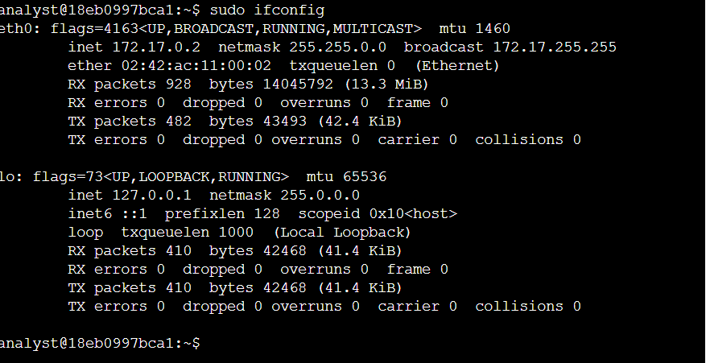
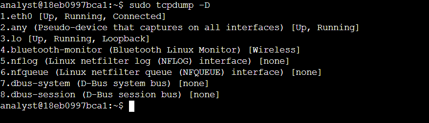
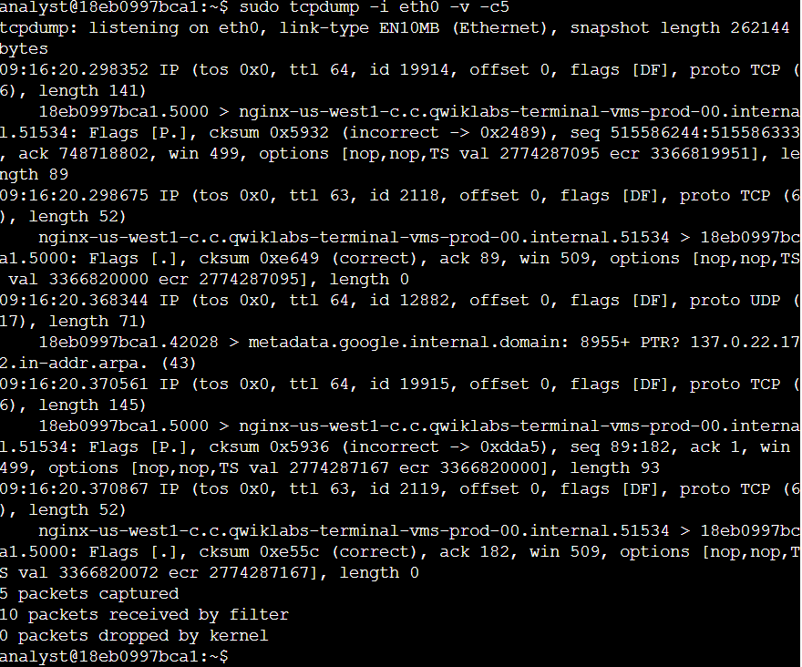
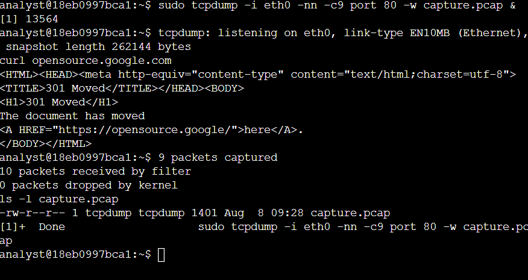
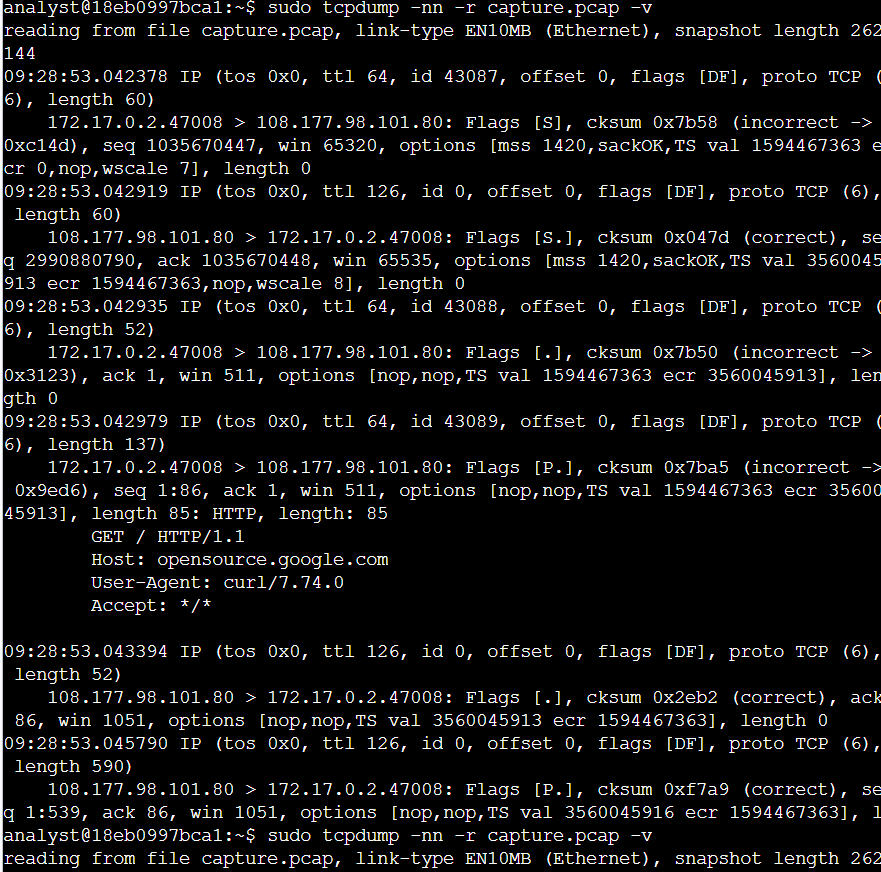
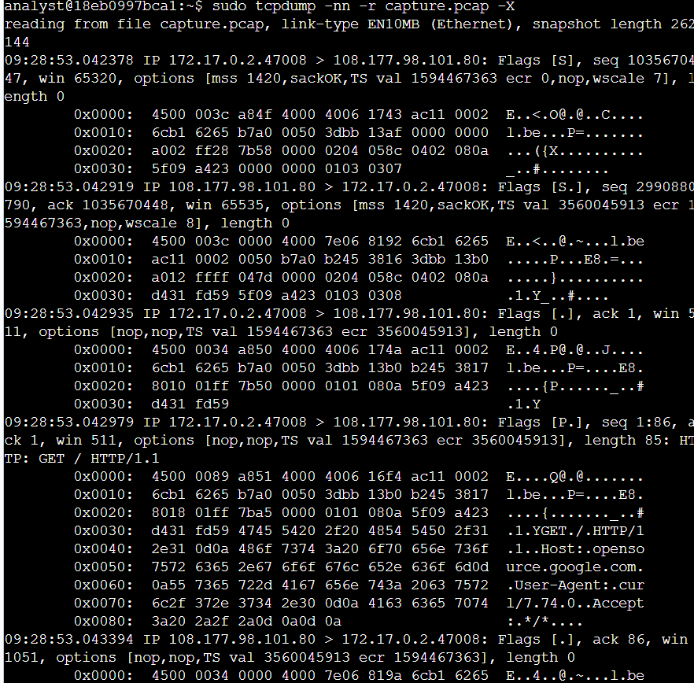

# TCPDump Packet Capture

## Project Overview

This project documents my hands-on experience using TCPDump to capture and inspect network traffic in a Linux environment. I worked with network interfaces, captured live packets, saved network traffic to a PCAP file, and reviewed the captured data from the command line.

The activity helped me understand how packet capture tools can be used to observe network communication and examine information such as IP addresses, ports, protocols, TCP flags, sequence numbers, and packet contents.

---

## Scenario

As part of a security investigation, network traffic needs to be captured and examined to understand communication between systems. TCPDump provides a command-line method for capturing packets directly from a network interface and analyzing the resulting traffic.

In this activity, I used the `eth0` network interface, captured HTTP traffic, saved the captured packets to `capture.pcap`, and then reviewed the saved capture using different TCPDump options.

---

## Objective

The main objectives of this activity were to:

- Identify available network interfaces.
- Determine which interface could be used for packet capture.
- Inspect live network traffic from the command line.
- Capture HTTP traffic and save it to a PCAP file.
- Read packets from the saved capture.
- Examine packet contents in hexadecimal and ASCII formats.

---

# 1. Identify Network Interfaces

## Description

Before capturing any traffic, I first checked the network configuration to identify the available interfaces on the Linux system.

```bash
sudo ifconfig
```

<div align="center">

</div>

The output showed the available network interfaces, including `eth0` and the loopback interface `lo`.

The `eth0` interface was active and had an assigned IPv4 address, making it the interface I used for the packet capture.

---

## Checking TCPDump Capture Interfaces

I also used TCPDump itself to list the interfaces available for packet capture.

```bash
sudo tcpdump -D
```

<div align="center">

</div>

The output listed several available capture interfaces. The `eth0` interface appeared as an active, running interface, so I selected it for the following packet capture tasks.

This step was useful because it confirmed that TCPDump could access the network interface I intended to monitor.

---

# 2. Inspect Live Network Traffic

## Description

After identifying `eth0` as the interface to use, I captured a small sample of live network traffic to see what information TCPDump displays for individual packets.

I limited the capture to five packets so the output would remain manageable while still providing enough information to examine the traffic.

## TCPDump Command

```bash
sudo tcpdump -i eth0 -v -c5
```

<div align="center">

</div>

## Analysis

The `-i eth0` option tells TCPDump which network interface to monitor. The `-v` option increases the amount of information displayed for each packet, while `-c5` stops the capture after five packets.

The output showed different types of network communication, including TCP and UDP packets. Each packet contained information such as:

- Source and destination addresses
- Source and destination ports
- Protocol information
- TCP flags
- Sequence and acknowledgment numbers
- Packet length

For example, the TCP packets showed communication between the local system and another host, while the UDP packet showed traffic associated with DNS-related communication.

This gave me a practical view of what network traffic looks like from the command line before saving any packets to a capture file.

---

# 3. Capture Network Traffic to a PCAP File

## Description

After inspecting live traffic, I captured HTTP traffic and saved it to a PCAP file. Saving the traffic allowed me to review the packets later instead of relying only on the live output.

I used TCPDump with a packet count of nine and filtered the capture for traffic associated with port `80`.

## Capture Command

```bash
sudo tcpdump -i eth0 -nn -c9 port 80 -w capture.pcap &
```

<div align="center">

</div>

The command starts TCPDump in the background and writes the captured packets to `capture.pcap`.

I then generated HTTP traffic with:

```bash
curl opensource.google.com
```

The response showed that the requested page had moved and returned a `301 Moved` response.

Finally, I verified that the capture file had been created:

```bash
ls -l capture.pcap
```

The output confirmed that `capture.pcap` existed and contained the captured network traffic.

---

# 4. Read the Captured PCAP File

## Description

After creating `capture.pcap`, I used TCPDump to read the packets stored in the file instead of capturing new traffic. This allowed me to examine the saved network activity and review the details of the communication that had already been captured.

## TCPDump Command

```bash
sudo tcpdump -nn -r capture.pcap -v
```

<div align="center">

</div>

## Analysis

The `-r` option tells TCPDump to read packets from an existing capture file rather than listening on a network interface.

I also used `-nn` to prevent TCPDump from resolving IP addresses and port numbers into names. This keeps the output focused on the actual numeric values present in the capture.

The `-v` option provides additional packet information. In the output, I could inspect details such as:

- Source and destination IP addresses
- Source and destination ports
- TCP flags
- Sequence and acknowledgment numbers
- Packet length
- HTTP request and response information

One of the packets contained an HTTP request:

```text
GET / HTTP/1.1
Host: opensource.google.com
User-Agent: curl/7.74.0
```

The capture also contained an HTTP response with a `301 Moved Permanently` status, showing that the requested resource redirected to another location.

Reading the PCAP file this way made it possible to investigate previously captured traffic without generating the traffic again.

---

# 5. Inspect Packet Data in Hexadecimal and ASCII

## Description

For a deeper look at the captured packets, I used TCPDump's hexadecimal and ASCII output option. This provides a lower-level view of the packet data and can reveal readable application-layer information contained within the captured traffic.

## TCPDump Command

```bash
sudo tcpdump -nn -r capture.pcap -X
```

<div align="center">

</div>

## Analysis

The `-X` option displays packet data in both hexadecimal and ASCII formats.

The hexadecimal section represents the raw packet bytes, while the ASCII section attempts to display readable characters from those bytes. This makes it possible to recognize application-level content inside the captured packets.

In the output, the HTTP request could be identified within the packet data, including:

```text
GET / HTTP/1.1
Host: opensource.google.com
User-Agent: curl/7.74.0
Accept: */*
```

This provided a more detailed view of what was actually carried inside the captured network packets rather than only showing the packet headers.

---
# Key Concepts Learned

Throughout this activity, I gained practical experience using TCPDump from the Linux command line to capture and investigate network traffic.

The main concepts I worked with included:

- Identifying available network interfaces before starting a packet capture.
- Selecting `eth0` as the interface for monitoring network traffic.
- Capturing a limited number of packets from live network traffic.
- Using TCPDump options to control the amount of packet information displayed.
- Filtering traffic by TCP port to focus on HTTP communication.
- Saving captured packets to a `.pcap` file for later analysis.
- Reading previously captured traffic directly from a PCAP file.
- Examining IP addresses, ports, TCP flags, sequence numbers, and acknowledgment numbers.
- Inspecting packet contents in hexadecimal and ASCII formats.
- Identifying readable HTTP information inside captured packet data.

---

# TCPDump Commands Used

| Command | Purpose |
|---|---|
| `sudo ifconfig` | Review the available network interfaces and their configuration. |
| `sudo tcpdump -D` | List the interfaces available for packet capture. |
| `sudo tcpdump -i eth0 -v -c5` | Capture five packets from `eth0` with additional packet information. |
| `sudo tcpdump -i eth0 -nn -c9 port 80 -w capture.pcap &` | Capture nine packets associated with port 80 and save them to `capture.pcap`. |
| `sudo tcpdump -nn -r capture.pcap -v` | Read the saved PCAP file and display detailed packet information. |
| `sudo tcpdump -nn -r capture.pcap -X` | Read the PCAP file and display packet data in hexadecimal and ASCII formats. |

---

# Summary

This project gave me hands-on experience using TCPDump to capture and analyze network traffic from a Linux command line. I first identified the available network interfaces, selected `eth0`, and inspected live packets before creating a packet capture.

I then captured HTTP traffic and saved it as `capture.pcap`, which allowed me to review the traffic later using TCPDump. Reading the saved packets helped me examine network information such as IP addresses, ports, TCP flags, and HTTP requests, while the hexadecimal and ASCII output provided a deeper view of the data carried inside the packets.

The activity strengthened my understanding of command-line packet analysis and showed how TCPDump can be used as a practical network monitoring and investigation tool during cybersecurity analysis.