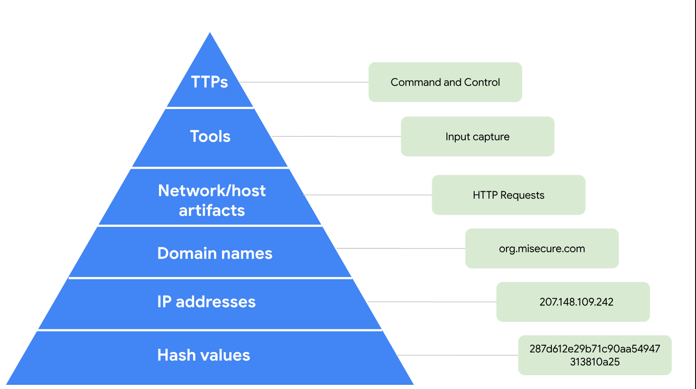

# Investigate a Suspicious File

## Project Overview

This project documents a suspicious file investigation performed in a financial services environment. The investigation began after an alert was generated when a suspicious file was downloaded to an employee's workstation.

I investigated the file by creating a SHA256 hash and using VirusTotal to gather additional information about the file and identify indicators associated with it. The activity provided practical experience with file identification, threat intelligence, and basic malware investigation.

---

## Scenario

A cybersecurity analyst working for a financial services company received an alert about a suspicious file downloaded to an employee's computer.

The employee had received an email containing a password-protected attachment. The password was provided in the same email. After the employee entered the password, the file began executing on the workstation.

An intrusion detection system later detected suspicious executable files and generated an alert. The file was then investigated to determine whether it was malicious and to identify additional indicators that could support the investigation.

---

## Objective

The objective of this activity was to investigate the suspicious file and determine whether it was associated with malicious activity.

The investigation focused on:

- Creating a SHA256 hash of the suspicious file.
- Investigating the hash using VirusTotal.
- Identifying indicators associated with the file.
- Reviewing domains and IP addresses connected to the file.
- Using the Pyramid of Pain to understand different types of indicators.
- Documenting the findings from the investigation.

---

## Tools Used

| Tool | Purpose |
|------|---------|
| **Linux** | Used to create the SHA256 hash of the suspicious file. |
| **VirusTotal** | Used to investigate the file hash and identify additional indicators of compromise. |
| **Pyramid of Pain** | Used to organize and understand different types of indicators associated with malicious activity. |

---

# Investigation

## Initial Alert

The investigation started after an alert was generated for a suspicious file downloaded to an employee's workstation.

The employee had received a password-protected attachment through email. The password was included in the email, and after the employee entered it, the file began executing.

The alert provided the starting point for investigating the file and determining whether it was associated with malicious activity.

---

## File Hashing

I first created a SHA256 hash of the suspicious file using Linux.

```bash
sha256sum <suspicious-file>

# Indicators of Compromise

The VirusTotal investigation provided several indicators associated with the suspicious file. These indicators expanded the investigation beyond the original SHA256 hash and provided additional information that could be useful for identifying related activity.

| IoC Type | Finding |
|----------|---------|
| Hash Values | The file was associated with additional hash values, including MD5 and SHA-1. |
| Domain Names | The file was associated with more than 100 contacted domains. |
| IP Addresses | The file was associated with more than 431 contacted IP addresses. |

These indicators provide additional context for investigating the suspicious file and can be used as references when looking for related activity.

---

# Pyramid of Pain

The Pyramid of Pain provides a way to understand different types of indicators associated with malicious activity. It ranges from technical indicators such as hashes and IP addresses to higher-level information about attacker behavior and Tactics, Techniques, and Procedures (TTPs).



In this investigation, the identified hash values, domains, and IP addresses represent technical indicators that can help security analysts detect or investigate related activity.

Understanding where these indicators fit within the Pyramid of Pain also helps show why some indicators are easier for attackers to change than others.

---

# Findings

The investigation provided several findings that helped establish the nature of the suspicious file.

First, the SHA256 hash provided a unique identifier that could be investigated through VirusTotal. The VirusTotal results showed that **53 of 71 security vendors** identified the file as malicious.

The investigation also identified more than **100 contacted domains** and more than **431 contacted IP addresses** associated with the file. Additional hash values, including MD5 and SHA-1, were also identified.

Taken together, these findings provided strong evidence that the file was malicious and gave additional indicators that could be used during further investigation and detection.

# Key Learning Outcomes

This activity gave me practical experience investigating a suspicious file from an initial security alert through basic threat intelligence analysis.

The main concepts I worked with included:

- Creating a SHA256 hash to identify a suspicious file.
- Using a file hash as an initial artifact for investigation.
- Using VirusTotal to investigate suspicious files.
- Reviewing security vendor detections.
- Identifying related domains and IP addresses.
- Identifying additional file hashes.
- Understanding Indicators of Compromise (IoCs).
- Using the Pyramid of Pain to understand different types of indicators.
- Connecting individual file artifacts to broader security investigation findings.

---

# Conclusion

This investigation showed how a suspicious file can be examined using a combination of file hashing and threat intelligence. I started with the file itself, created a SHA256 hash, and used that hash to investigate the file through VirusTotal.

The investigation identified multiple security vendor detections along with associated domains, IP addresses, and additional hash values. These findings provided useful evidence for determining that the file was malicious and demonstrated how a single file can lead to the discovery of multiple indicators.

The activity also helped me understand how technical indicators can support security investigations and how the Pyramid of Pain can be used to organize different types of indicators associated with malicious activity.