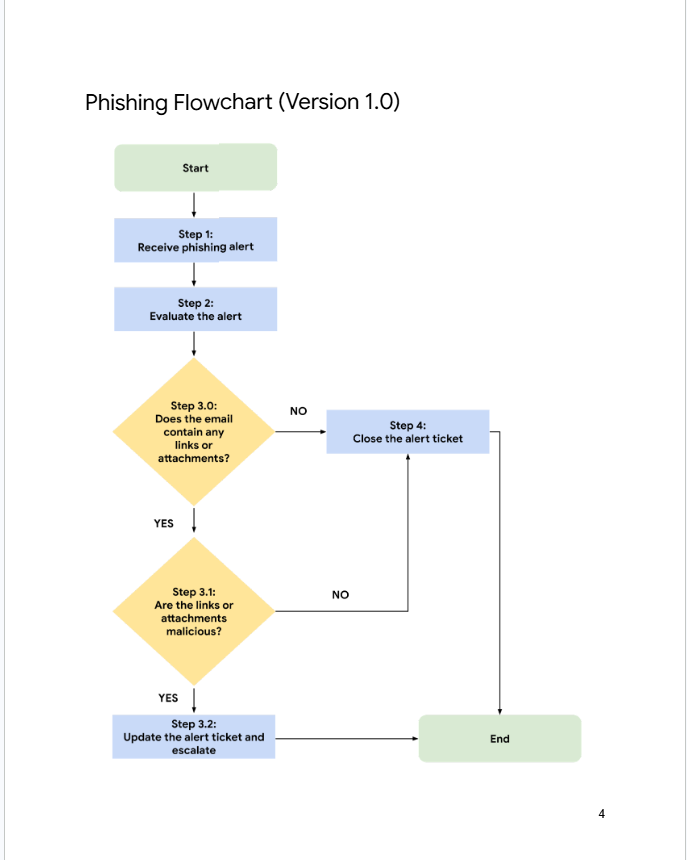

# Phishing Alert Investigation – SOC Analyst Case Study

## Overview

This project documents a phishing alert investigation performed as a Level-1 Security Operations Center (SOC) analyst at a financial services company.

The activity focuses on following a phishing response playbook to evaluate an alert, examine the associated email and attachment, determine whether the attachment is malicious, and update the alert ticket based on the investigation findings.

The investigation involved a password-protected executable attachment named `bfsvc.exe`. The file had already been verified as malicious through its SHA256 hash using VirusTotal. Based on the confirmed malicious attachment and the additional findings from the alert investigation, the ticket was escalated for further investigation by a Level-2 SOC analyst.

---

## Scenario

A Level-1 SOC analyst received a phishing alert concerning a potentially malicious file downloaded onto an employee's computer at a financial services company.

The alert indicated that the employee had received an email containing a password-protected attachment. The email provided the password required to open the attachment.

The associated file had already been investigated in a previous activity and its SHA256 hash was verified as malicious. The purpose of this activity was to use the organization's phishing playbook to evaluate the alert, confirm the appropriate response path, document the findings, and update the alert ticket.

---

## Objective

The objective of this activity is to practice following a structured incident response playbook when investigating a phishing alert.

The investigation focuses on:

- Evaluating the alert and its severity.
- Reviewing sender, receiver, and email details.
- Identifying suspicious links or attachments.
- Determining whether the attachment is malicious.
- Applying the appropriate playbook decision.
- Updating the alert ticket with investigation findings.
- Escalating the confirmed malicious alert for further investigation.

---

## Activity Context

This activity demonstrates how a SOC analyst can use a predefined response procedure to make a consistent decision during a phishing investigation.

The phishing playbook provides the sequence of actions required to evaluate the alert and determine whether the ticket should be closed or escalated. In this case, the presence of a confirmed malicious executable attachment required the alert to be escalated.

## Phishing Playbook

The phishing playbook provides a structured process for Level-1 SOC analysts to respond to phishing alerts. It defines the steps used to evaluate an alert, determine whether an email contains a potentially malicious link or attachment, and decide whether the alert should be closed or escalated.

### Playbook Workflow

The investigation follows these steps:

1. **Step 1 — Receive phishing alert**
   - Begin when a phishing alert ticket is received.

2. **Step 2 — Evaluate the alert**
   - Review the alert severity.
   - Examine receiver and sender details.
   - Review the subject line and message body.
   - Check for attachments or links.

3. **Step 3.0 — Does the email contain any links or attachments?**
   - If the email contains a link or attachment, do not open it directly.
   - Proceed to Step 3.1.
   - If there are no links or attachments, proceed to Step 4.

4. **Step 3.1 — Are the links or attachments malicious?**
   - Investigate the reputation of the link or attachment.
   - Use available threat intelligence information, such as file hash results, to determine whether the attachment is malicious.

5. **Step 3.2 — Update the alert ticket and escalate**
   - If the attachment or link is confirmed malicious, document the findings.
   - Update the ticket status to **Escalated**.
   - Escalate the ticket for further investigation by the appropriate security personnel.

6. **Step 4 — Close the alert ticket**
   - Close the ticket when the email contains no links or attachments, or when the identified link or attachment has been confirmed as not malicious.

---

### Phishing Flowchart

The flowchart provides a visual representation of the decision-making process used during the phishing investigation.

<div align="center">

</div>

The flowchart shows how the investigation moves from receiving and evaluating the phishing alert to either closing the ticket or escalating it when a malicious attachment or link is confirmed.## Alert Evaluation

The alert ticket was reviewed according to the evaluation steps defined in the phishing playbook. The purpose of this step was to understand why the alert was triggered and identify information that could indicate a phishing attempt.

### Alert Details

| **Field** | **Finding** |
| :--- | :--- |
| **Ticket ID** | A-2703 |
| **Alert Message** | SERVER-MAIL — Phishing attempt, possible download of malware |
| **Severity** | Medium |
| **Ticket Status** | Escalated |
| **Sender** | Def Communications |
| **Sender IP Address** | 114.114.114.114 |
| **Receiver** | hr@inergy.com |
| **Receiver IP Address** | 176.157.125.93 |
| **Subject** | Re: Infrastructure Egnieer role |
| **Attachment** | `bfsvc.exe` |
| **Known Malicious File Hash** | `54e6ea47eb04634d3e87fd7787e2136ccfbcc80ade34f246a12cf93bab527f6b` |

### Suspicious Indicators

Several details in the alert indicated that the email required further investigation:

- The alert had a **Medium** severity, which may require escalation according to the phishing playbook.
- The email originated from a suspicious sender address and sender IP address.
- The email contained a password-protected executable attachment named `bfsvc.exe`.
- The password required to open the attachment was provided directly in the email.
- The attachment's SHA256 hash had already been verified as malicious.
- VirusTotal reported that **53 of 71 security vendors** identified the file as malicious.

### Initial Assessment

The presence of an executable attachment, the suspicious sender information, and the confirmed malicious file hash provided sufficient evidence that the phishing alert was legitimate and required further investigation.

Based on the playbook, the investigation therefore proceeded to the attachment analysis and escalation decision rather than closing the alert.## Investigation and Playbook Decision

After evaluating the alert, I followed the next steps in the Phishing Playbook to determine whether the email contained an attachment and whether the attachment was malicious.

### Step 3.0 — Check for Links or Attachments

The email contained an attachment named `bfsvc.exe`.

The attachment was an executable file and was password protected. The password required to open the file was provided directly in the email.

Because the email contained an attachment, the investigation proceeded to **Step 3.1** of the Phishing Playbook.

> **Important:** The attachment was not opened directly during the investigation. The file's known SHA256 hash was used to verify its reputation through threat intelligence.

---

### Step 3.1 — Determine Whether the Attachment Is Malicious

The SHA256 hash associated with the attachment was:

```text
54e6ea47eb04634d3e87fd7787e2136ccfbcc80ade34f246a12cf93bab527f6b
```
# Incident Handler's Journal — Phishing Alert Investigation
| **Date:**<br>Record the date of the journal entry. | **Entry:** 005<br>**Date:** 10 August 2026 |
|---|---|
| **Description** | I am a security analyst working at a financial services company. I received an alert about a suspicious file being downloaded on an employee's computer. The file hash was already verified as malicious and reported by several vendors on VirusTotal. As part of the organization's procedure, I need to follow the phishing playbook to conduct further investigation. |
| **Tool(s) Used** | **VirusTotal** — Used to verify the malicious file hash and investigate additional information about the file.<br><br>**Phishing Playbook** — Used as a guide for the step-by-step investigation and response process. |
| **The 5 W's** | **Who caused the incident:**<br>Unknown malicious actor.<br><br>**What happened:**<br>An employee received a phishing email containing a password-protected malicious attachment named `bfsvc.exe`. The password was provided in the email, allowing the employee to open the attachment and download the malicious file onto the computer.<br><br>**When did the incident occur:**<br>The employee received the phishing email on Wednesday, July 20, 2022, at approximately 09:30:14 AM.<br><br>**Where did the incident happen:**<br>On an employee's workstation at a financial services company.<br><br>**Why did the incident happen:**<br>An unknown malicious actor sent a phishing email containing a password-protected malicious attachment. The employee opened the attachment without verifying the email, which allowed the malicious file to be downloaded onto the computer. |
| **Additional Notes** | 1. Employees aren't aware of the phishing emails.<br><br>2. I found that the email is malicious and reported by several vendors.<br><br>3. The email severity is Medium, and the incident has been escalated and sent for further investigation. |

---

## Key Learning Outcomes

This activity provided practical experience responding to a phishing alert by following a structured security playbook.

Through this investigation, I demonstrated the ability to:

- Evaluate the severity and details of a phishing alert.
- Examine sender, receiver, subject, message, and attachment information.
- Identify suspicious characteristics within a phishing email.
- Determine whether an email contains a potentially malicious attachment.
- Use an existing file hash investigation to confirm malicious activity.
- Apply a phishing response playbook to determine the appropriate next step.
- Document investigation findings in an alert ticket.
- Determine when an alert requires escalation.
- Escalate a confirmed malicious phishing alert to a Level-2 SOC analyst.
- Maintain structured incident documentation through the Incident Handler's Journal.

---

## Conclusion

This activity demonstrated how a Level-1 SOC analyst can use a predefined phishing playbook to investigate and respond to a security alert in a structured manner.

The investigation began by evaluating the alert and examining the email details. The presence of a password-protected executable attachment, suspicious sender information, and a confirmed malicious file hash provided evidence that the alert represented a legitimate phishing threat.

Following the playbook, the attachment was determined to be malicious and the alert was escalated rather than closed. The alert ticket was updated with the investigation findings and the reason for escalation.

This activity strengthened my understanding of phishing alert investigation, playbook-driven incident response, alert documentation, and SOC escalation procedures.

---