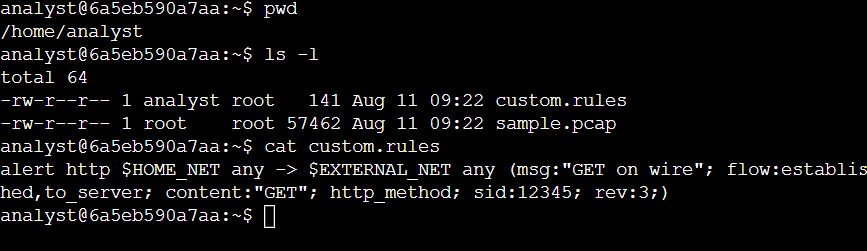
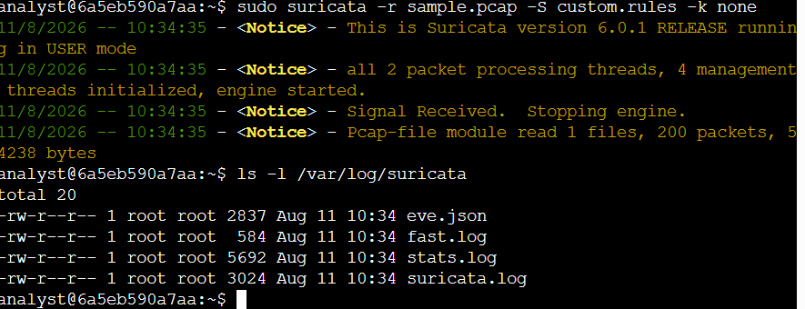
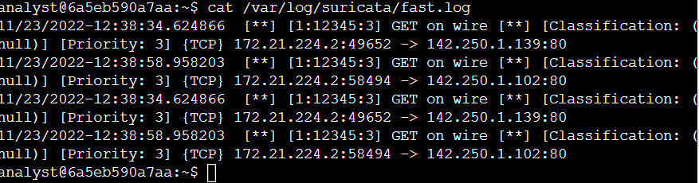
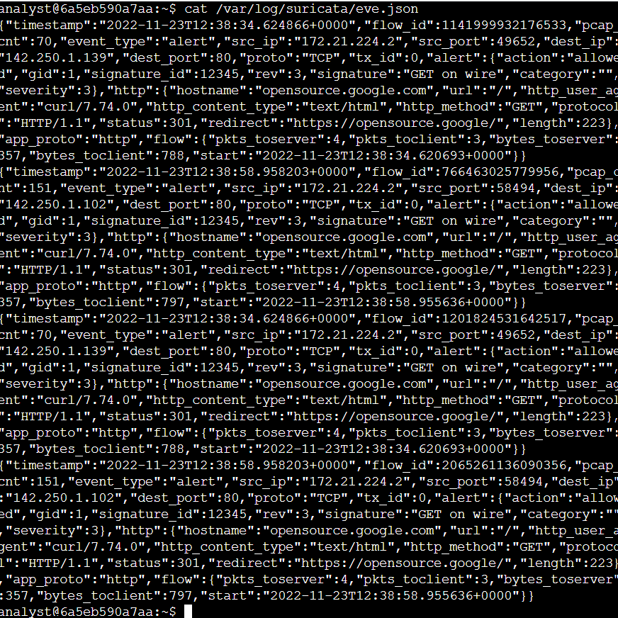
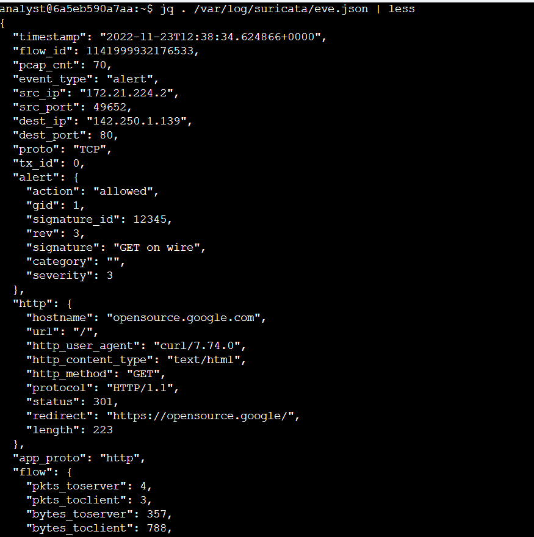
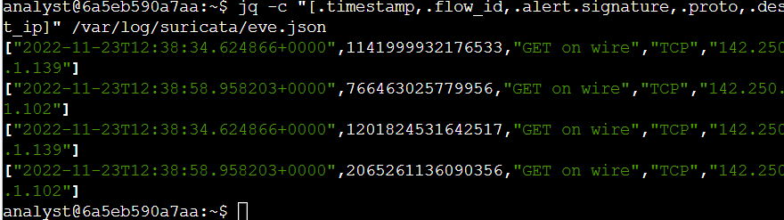
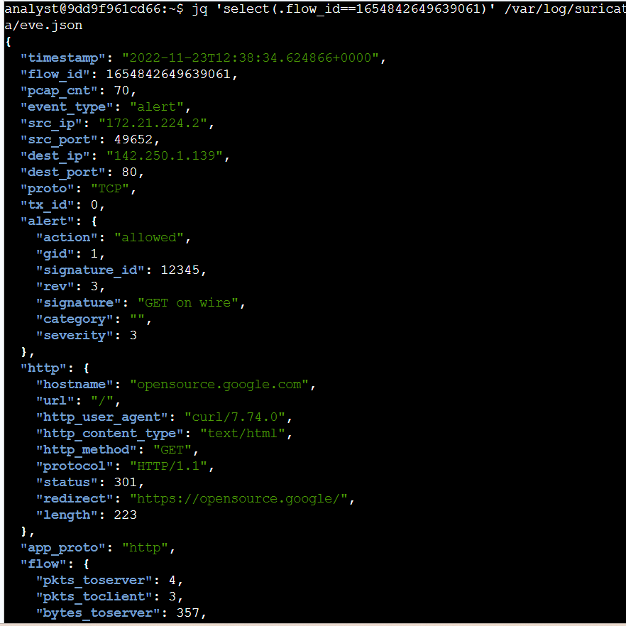

# Suricata Alert Analysis

## Activity Overview

This activity focuses on using **Suricata** to examine custom detection rules, trigger alerts against captured network traffic, and analyze the logs generated by Suricata.

The activity uses a supplied `sample.pcap` file containing example network traffic and a `custom.rules` file containing a Suricata detection rule. The traffic is processed through the rule to generate alerts, which are then examined through the `fast.log` and `eve.json` log files.

## Objective

The objective of this activity is to gain practical experience with:

- Examining the structure of a custom Suricata rule.
- Running Suricata against a packet capture file.
- Triggering a custom detection rule.
- Analyzing alerts generated in `fast.log`.
- Examining detailed event data in `eve.json`.
- Using `jq` to format and extract information from JSON logs.
- Understanding how `flow_id` can be used to correlate network events.

## Tools Used

- **Suricata** — Used to process network traffic and apply custom detection rules.
- **Linux Command Line** — Used to create, inspect, and process the rule and log files.
- **jq** — Used to format and extract specific fields from the `eve.json` output.
- **sample.pcap** — Packet capture file used as the network traffic input.
- **custom.rules** — Custom Suricata rule used to generate alerts.

---

## 1. Examine a Custom Suricata Rule

The first step of the activity was to examine the custom Suricata rule stored in the `custom.rules` file.

### Command

```bash
cat custom.rules
```

### Custom Rule

```text
alert http $HOME_NET any -> $EXTERNAL_NET any (msg:"GET on wire"; flow:established,to_server; content:"GET"; http_method; sid:12345; rev:3;)
```



### Rule Components

The custom Suricata rule contains three main components:

- **Action**
- **Header**
- **Rule Options**

### Action

```text
alert
```

The `alert` action instructs Suricata to generate an alert when network traffic matches the conditions defined by the rule.

### Header

```text
http $HOME_NET any -> $EXTERNAL_NET any
```

The header defines the protocol, source network, source port, destination network, and destination port used by the rule.

- `http` — Specifies HTTP traffic.
- `$HOME_NET` — Represents the local or home network.
- `any` — Allows any source port.
- `->` — Defines the direction of the traffic.
- `$EXTERNAL_NET` — Represents the external network.

### Rule Options

```text
msg:"GET on wire";
flow:established,to_server;
content:"GET";
http_method;
sid:12345;
rev:3;
```

The rule options provide additional conditions and information used by Suricata when evaluating the traffic.

- `msg:"GET on wire"` — Defines the message displayed when the rule generates an alert.
- `flow:established,to_server` — Matches established traffic traveling toward the server.
- `content:"GET"` — Searches for the `GET` content.
- `http_method` — Specifies that the content should be evaluated as an HTTP method.
- `sid:12345` — Identifies the rule using a unique signature ID.
- `rev:3` — Identifies the revision number of the rule.

### Rule Interpretation

Overall, this custom rule is designed to generate an alert when Suricata detects an HTTP `GET` request in established traffic traveling from the home network toward the external network.

---
## 2. Run Suricata Against the Packet Capture

After examining the custom detection rule, the next step was to run Suricata against the provided `sample.pcap` file and apply the rule from `custom.rules`.

### Command

```bash
sudo suricata -r sample.pcap -S custom.rules -k none
```

### Command Breakdown

- `sudo` — Runs Suricata with the required permissions.
- `suricata` — Starts the Suricata network analysis engine.
- `-r sample.pcap` — Reads packets from the existing packet capture file.
- `-S custom.rules` — Loads the custom rule file for detection.
- `-k none` — Disables checksum validation while processing the packet capture.

### Suricata Processing

Suricata processed the packets contained in `sample.pcap` and applied the custom rule against the captured network traffic.

The command completed successfully and reported that the PCAP file was processed. Suricata then generated its log files under `/var/log/suricata/`.



### Observation

The custom rule was successfully loaded and applied to the packet capture. The generated Suricata logs provided the alert information required for the next stage of the investigation.

The primary output files generated during the activity were:

- `fast.log` — Contains a concise representation of generated alerts.
- `eve.json` — Contains structured JSON event data with additional details about the detected network activity.
- `suricata.log` — Contains Suricata engine and processing information.
- `stats.log` — Contains statistics related to packet processing.

---
## 3. Analyze the Suricata Alert Log

After running Suricata against the packet capture, the next step was to examine the alert information generated by the custom rule.

### Command

```bash
cat /var/log/suricata/fast.log
```

### Alert Output

The `fast.log` file contained multiple alerts generated by the custom rule. Each alert identified the detected `GET on wire` activity and included information about the source and destination of the network communication.



### Observations

The alerts showed that the custom rule successfully detected HTTP `GET` requests in the captured traffic.

The alert output provided information including:

- Alert timestamp.
- Suricata signature ID.
- Alert message.
- Source IP address and port.
- Destination IP address and port.
- Network protocol.
- Alert severity.

The generated alerts showed communication from internal source addresses toward external destinations over TCP port `80`.

### Key Finding

The `fast.log` output confirmed that the custom Suricata rule was successfully triggered by matching HTTP `GET` requests in the packet capture.

The alert information provides a concise view of the detected activity and can be used as an initial reference before examining the more detailed event information contained in `eve.json`.

---
## 4.1 Examine the `eve.json` Alert Output

After reviewing the concise alerts in `fast.log`, the next step was to examine the structured event information generated by Suricata in the `eve.json` file.

### Command

```bash
cat /var/log/suricata/eve.json
```

### EVE JSON Output

The `eve.json` file contains structured information about the alerts generated by Suricata. Each event provides additional details about the network communication that triggered the custom rule.



### Observations

The JSON output provided more detailed information than the `fast.log` file, including:

- Event timestamp.
- `flow_id` used to identify the network flow.
- Source IP address and source port.
- Destination IP address and destination port.
- Network protocol.
- Suricata signature information.
- Alert action and severity.
- HTTP hostname.
- Requested URL.
- HTTP method.
- HTTP protocol version.
- HTTP response status.
- HTTP redirect information.
- Application protocol.
- Flow packet and byte counts.

The alert data showed HTTP `GET` requests from internal source addresses to external destinations over TCP port `80`.

### Example Findings

The generated event data included the following information:

```text
event_type: alert
src_ip: 172.21.224.2
dest_ip: 142.250.1.139
dest_port: 80
proto: TCP
signature: GET on wire
severity: 3
hostname: opensource.google.com
http_method: GET
protocol: HTTP/1.1
status: 301
```

The HTTP response also indicated a redirect from:

```text
http://opensource.google.com/
```

to:

```text
https://opensource.google/
```

### Key Finding

The `eve.json` output provided a more detailed representation of the detected network activity than `fast.log`. It allowed the alert to be examined together with HTTP, flow, source, and destination information, providing additional context for investigating the detected traffic.

---
## 4.2. Format the `eve.json` Output Using `jq`

After examining the raw `eve.json` output, the next step was to use the `jq` command-line tool to format the JSON data so that the alert information could be read more clearly.

### Command

```bash
jq . /var/log/suricata/eve.json | less
```

### Formatted JSON Output

The `jq` command formatted the JSON data into a structured, human-readable format. The output made it easier to inspect individual fields within each Suricata alert event.



### Observations

The formatted output made several important fields easier to identify and examine, including:

- `timestamp` — Records when the event occurred.
- `flow_id` — Identifies the network flow associated with the event.
- `event_type` — Identifies the type of Suricata event.
- `src_ip` — Identifies the source IP address.
- `src_port` — Identifies the source port.
- `dest_ip` — Identifies the destination IP address.
- `dest_port` — Identifies the destination port.
- `proto` — Identifies the network protocol.
- `alert` — Contains the Suricata alert information.
- `http` — Contains information about the HTTP request and response.
- `flow` — Contains information about packets and bytes exchanged during the flow.

### Key Finding

Using `jq` provided a clearer way to inspect the structured Suricata event data. Instead of reading the entire JSON output as a continuous line of text, the fields could be examined individually and used for further analysis.

---
## 4.3 Extract Specific Event Fields

After formatting the `eve.json` output with `jq`, the next step was to extract specific fields from the Suricata alert events. This makes it easier to focus on the information that is most relevant during network traffic analysis.

### Command

```bash
jq -c 'select(.event_type=="alert") | {timestamp, flow_id, signature: .alert.signature, proto, dest_ip}' /var/log/suricata/eve.json
```

### Command Breakdown

- `jq -c` — Processes the JSON and displays each resulting object in compact form.
- `select(.event_type=="alert")` — Filters the JSON data to include only events classified as alerts.
- `{timestamp, flow_id, ...}` — Selects specific fields from each alert event.
- `signature: .alert.signature` — Extracts the Suricata alert signature and displays it as `signature`.
- `proto` — Displays the network protocol associated with the event.
- `dest_ip` — Displays the destination IP address.

### Extracted Information

The command extracts the following fields:

| **Field** | **Purpose** |
| :--- | :--- |
| `timestamp` | Identifies when the alert event occurred. |
| `flow_id` | Identifies the network flow associated with the event. |
| `signature` | Identifies the Suricata rule that generated the alert. |
| `proto` | Identifies the network protocol. |
| `dest_ip` | Identifies the destination IP address. |



### Observation

Filtering the JSON data to specific alert fields makes the Suricata output easier to review. Instead of examining the complete event record, the investigation can focus on the timestamp, network flow, triggered signature, protocol, and destination address.

The `flow_id` is particularly useful because it can be used to identify and correlate events belonging to the same network flow.

---
## 4.4 Flow ID Correlation

After extracting the alert fields from `eve.json`, the next step was to investigate a specific network flow using its `flow_id`.

### Command

```bash
jq 'select(.flow_id==1654842649639061)' /var/log/suricata/eve.json
```

### Flow ID Output

The command successfully filtered the `eve.json` file and returned the alert event associated with the selected `flow_id`.



### Observations

The returned event provided detailed information about the network flow, including:

- `flow_id` — `1654842649639061`
- `event_type` — `alert`
- `src_ip` — `172.21.224.2`
- `src_port` — `49652`
- `dest_ip` — `142.250.1.139`
- `dest_port` — `80`
- `proto` — `TCP`
- `signature_id` — `12345`
- `signature` — `GET on wire`
- `severity` — `3`
- `hostname` — `opensource.google.com`
- `http_method` — `GET`
- `protocol` — `HTTP/1.1`
- `status` — `301`
- `redirect` — `https://opensource.google/`

The event showed a TCP connection from `172.21.224.2:49652` to `142.250.1.139:80`. The custom Suricata rule generated the `GET on wire` alert with signature ID `12345` and severity `3`.

The HTTP information showed that the request used the `GET` method to access `opensource.google.com`. The server returned an HTTP `301` response and redirected the request to `https://opensource.google/`.

### Key Finding

The `flow_id` value `1654842649639061` successfully identified the corresponding Suricata network flow and allowed the alert event to be examined in greater detail.

Using `flow_id` provides a practical way to correlate and investigate network events within Suricata's structured `eve.json` logs.

---

## Key Learning Outcomes

This activity provided practical experience with Suricata-based network monitoring and log analysis.

Through this activity, I learned how to:

- Examine the structure of a custom Suricata detection rule.
- Understand Suricata rule actions, headers, and options.
- Apply a custom rule to an existing packet capture.
- Identify alerts generated from matching network traffic.
- Analyze Suricata `fast.log` output.
- Examine detailed event information in `eve.json`.
- Use `jq` to format and filter JSON event data.
- Extract specific alert fields for focused investigation.
- Understand the purpose of `flow_id` when correlating network events.
- Recognize and troubleshoot errors when constructing command-line queries.

## Conclusion

This activity provided practical experience using **Suricata** to detect and analyze network activity from a packet capture.

I examined a custom detection rule, applied the rule to the provided `sample.pcap` file, reviewed the alerts generated in `fast.log`, and analyzed the detailed event information contained in `eve.json`.

I also used `jq` to format and extract specific fields from the JSON logs. This helped me understand how structured security logs can be filtered to focus on relevant information such as alert signatures, protocols, destination IP addresses, and `flow_id` values.

The activity strengthened my understanding of **IDS alert generation, Suricata rule analysis, security log analysis, command-line investigation, and network event correlation**.