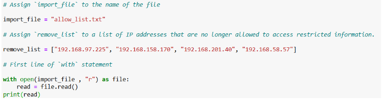
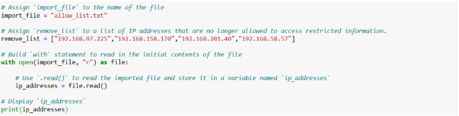
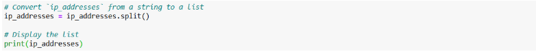
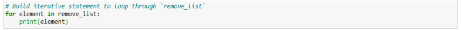
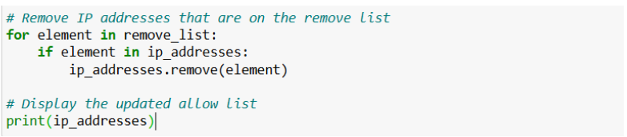
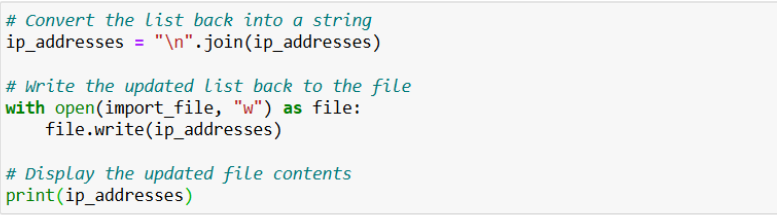

# Algorithm for File Updates in Python

## Activity Overview

This activity demonstrates how Python can be used to automate the management of an allow list that controls access to restricted network resources. The algorithm reads a file containing authorized IP addresses, compares it with a predefined remove list, removes unauthorized IP addresses, and updates the original file with the revised list. This automation helps reduce manual effort while ensuring that access permissions remain accurate and up to date.

## Objective

The objective of this activity is to gain practical experience with:

- Opening and reading files using Python.
- Working with file contents using the `.read()` method.
- Converting strings into lists using `.split()`.
- Iterating through lists with a `for` loop.
- Removing specific elements using the `.remove()` method.
- Converting lists back into strings using `.join()`.
- Writing updated data back to a file using the `.write()` method.
- Automating a common cybersecurity task involving access control management.

## Tools Used

- **Python 3** — Used to develop the automation script.
- **Python File Handling** — Used to read from and write to the allow list file.
- **Visual Studio Code / Python Lab Environment** — Used to write and execute the Python program.
- **allow_list.txt** — Stores the IP addresses that are authorized to access the restricted network.
- **remove_list** — Python list containing IP addresses that must be removed from the allow list.

## 1. Open the File that Contains the Allow List

The first step of the algorithm is to identify the file containing the authorized IP addresses and prepare it for processing. The filename is stored in a variable, and the file is opened in **read mode** so its contents can be accessed safely.

### Screenshot

  

### Code Explanation

The code begins by assigning the filename **`allow_list.txt`** to the variable `import_file`. This variable provides a reference to the file that stores the list of authorized IP addresses.

A second variable, `remove_list`, is created to store the IP addresses that should no longer have access to the restricted network. These addresses will be compared against the allow list later in the algorithm.

The `with open(import_file, "r") as file:` statement opens the file in **read (`"r"`) mode**. Using a `with` statement automatically closes the file after it has been processed, helping prevent resource leaks and making the code easier to manage.

The `.read()` method reads the entire contents of the file and stores them in the variable `read`. Finally, the `print()` function displays the file contents, allowing the data to be verified before additional processing takes place.

## 2. Read the File Contents

After opening the allow list file, the next step is to read its contents into memory. This allows the algorithm to access the authorized IP addresses and prepare them for processing in the following steps.

### Screenshot

  

### Code Explanation

The `.read()` method is used to read the entire contents of the **`allow_list.txt`** file. The data is stored in the variable `ip_addresses` as a single string, making it available for further processing.

Storing the file contents in a variable allows the algorithm to manipulate the data without repeatedly accessing the file. This improves efficiency and prepares the data for conversion into a list in the next step.

Finally, the `print(ip_addresses)` statement displays the contents of the file, allowing the data to be verified before additional processing takes place.

## 3. Convert the String into a List

Once the contents of the allow list have been read into a string, the next step is to convert that string into a list. This allows the algorithm to process each IP address individually, making it easier to search for and remove unauthorized entries.

### Screenshot

  

### Code Explanation

The `.split()` method is used to convert the `ip_addresses` string into a list of individual IP addresses. Since each IP address in the file is separated by a new line, `.split()` automatically separates the string into multiple list elements.

Converting the string into a list enables the algorithm to efficiently iterate through the IP addresses, compare them with the remove list, and modify the data when necessary.

Finally, the `print(ip_addresses)` statement displays the resulting list, allowing the converted data to be verified before continuing with the remaining steps of the algorithm.

## 4. Iterate Through the Remove List

After preparing the allow list for processing, the algorithm iterates through each IP address stored in the `remove_list`. This ensures that every unauthorized IP address is checked against the allow list before any modifications are made.

### Screenshot

  

### Code Explanation

The `for` loop is used to iterate through each IP address contained in the `remove_list`. During every iteration, the current IP address is assigned to the loop variable `element`, allowing the algorithm to process one address at a time.

Using a loop eliminates the need to manually compare each IP address, making the algorithm more efficient and scalable as the number of addresses increases.

Finally, the `print(element)` statement displays each IP address during the iteration, allowing the loop to be verified before applying the removal logic in the next step.

## 5. Remove IP Addresses that are on the Remove List

After iterating through the remove list, the algorithm checks whether each IP address exists in the allow list. If a match is found, the unauthorized IP address is removed, ensuring that only authorized users retain access to the restricted network.

### Screenshot

  

### Code Explanation

The `for` loop iterates through each IP address stored in the `remove_list`. During each iteration, the `if` statement uses the `in` operator to determine whether the current IP address (`element`) exists in the `ip_addresses` list.

If a matching IP address is found, the `.remove()` method deletes it from the allow list. This approach works because the `ip_addresses` list does not contain duplicate entries, meaning `.remove()` only needs to remove a single occurrence of each matching IP address.

After all unauthorized IP addresses have been processed, the `print(ip_addresses)` statement displays the updated allow list, allowing the results to be verified before the revised data is written back to the file.

## 6. Update the File with the Revised List of IP Addresses

After removing all unauthorized IP addresses from the allow list, the final step is to save the updated data back to the original file. This ensures that the allow list reflects the latest authorized IP addresses and can be used for future access control.

### Screenshot

  

### Code Explanation

The `.join()` method is used to convert the `ip_addresses` list back into a single string. By applying `"\n".join(ip_addresses)`, each IP address is separated by a newline character, preserving the original structure of the **`allow_list.txt`** file.

Next, the `with open(import_file, "w") as file:` statement opens the file in **write (`"w"`) mode**, allowing the existing contents to be overwritten with the updated allow list. Using a `with` statement ensures that the file is automatically closed after the write operation has completed.

The `.write()` method writes the updated string of authorized IP addresses back to the file, replacing the previous contents. Finally, the `print(ip_addresses)` statement displays the revised allow list, confirming that the unauthorized IP addresses have been successfully removed and the file has been updated.

## Key Learnings

- Learned how to use Python file handling techniques to read and update text files efficiently.
- Gained practical experience using the `open()` function with the `with` statement to safely manage file operations.
- Understood how the `.read()` method retrieves file contents for further processing.
- Learned to convert file data from a string into a list using the `.split()` method, making it easier to manipulate individual entries.
- Applied `for` loops and conditional statements to automate comparisons between an allow list and a remove list.
- Used the `.remove()` method to eliminate unauthorized IP addresses from the allow list.
- Converted the updated list back into a properly formatted string using the `.join()` method.
- Used the `.write()` method to overwrite the original file with the revised allow list.
- Demonstrated how Python automation can simplify repetitive administrative tasks while improving the accuracy and security of access control management.

## Summary

This project demonstrates how Python can be used to automate the management of an IP address allow list that controls access to restricted network resources. The algorithm opens and reads an existing allow list, converts the file contents into a list, compares the list against a predefined remove list, and removes any unauthorized IP addresses. After updating the allow list, the algorithm converts the data back into a string and writes the revised contents to the original file. By automating this process, the solution improves the accuracy of access control, reduces manual effort, and helps maintain the security of sensitive organizational resources.